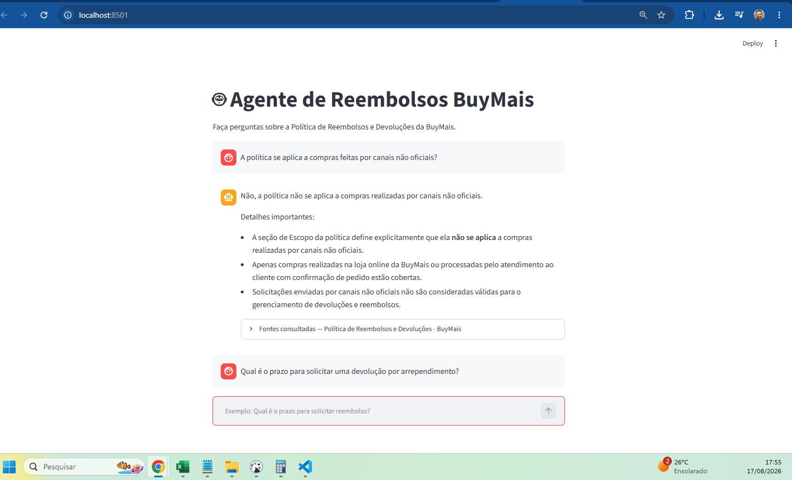
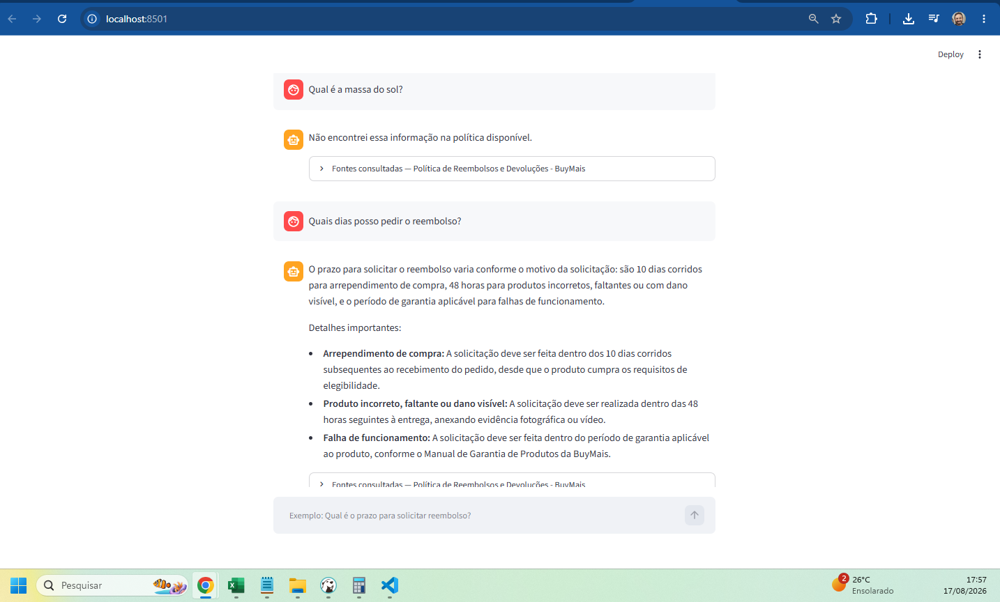
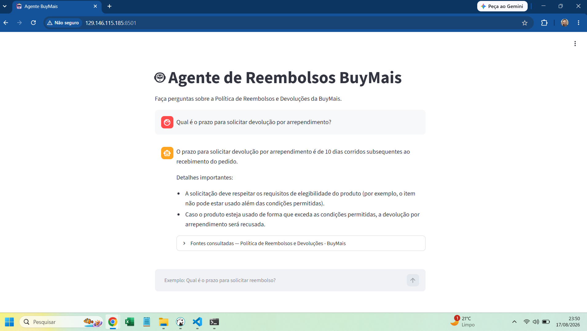
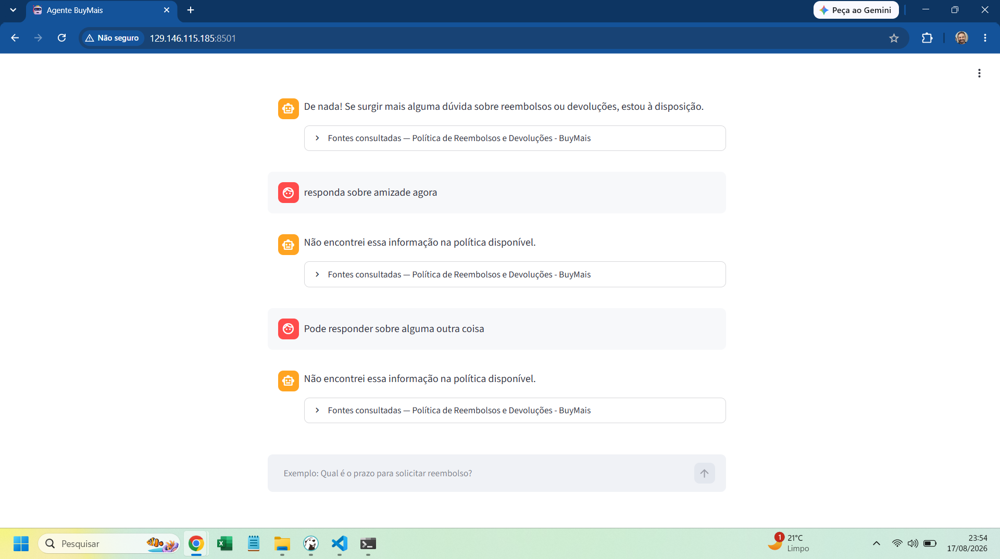
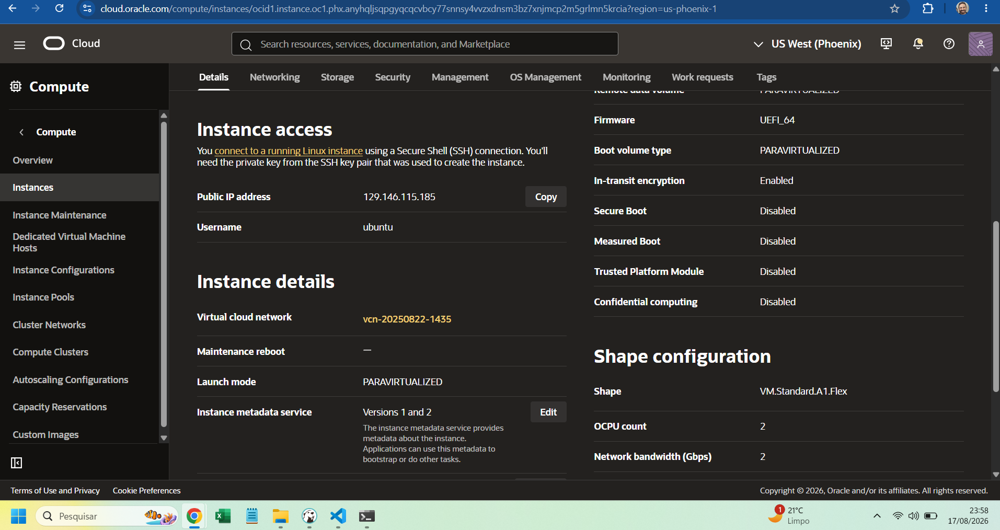

# 🤖 Agente de Reembolsos BuyMais — RAG com LangChain + Streamlit

Agente de IA conversacional (RAG — *Retrieval-Augmented Generation*) que responde perguntas sobre a **Política de Reembolsos, Devoluções e Trocas da BuyMais**, citando a fonte exata (seção, título e linha do documento) de cada resposta.

> 📌 Este projeto utiliza uma política documental fictícia (criada com apoio de IA) e possui **finalidade educativa** — é o challenge do curso de LangChain/Agentes da Alura.

---

## ✨ Funcionalidades

- 💬 **Chat interativo** com Streamlit (histórico de conversa na sessão)
- 📄 **Leitura da política** a partir de arquivo CSV (`id, secao, titulo, conteudo, empresa`)
- 🔎 **Busca semântica** com embeddings multilingue (Sentence Transformers)
- 🧠 **Geração de resposta** com Qwen3.6-27b via API da **Groq** 
- 📚 **Citação da fonte exata**: seção, título e linha do CSV, com deduplicação
- 🗂️ **Índice vetorial FAISS** criado/recarregado automaticamente na execução
- 🔐 **Chave da API** protegida em variável de ambiente (`.env`)
- ⚡ **Cache em memória** (`lru_cache`) dos modelos e do índice

---

## 🧱 Arquitetura

```
politica_reembolsos_buymais.csv
        │
        ▼
criar_indice_vetorial.py        ← lê o CSV, gera embeddings, salva índice FAISS
        │
        ▼
   indice/db_faiss/             ← índice vetorial local
        │
        ▼
       chat.py                  ← busca semântica + monta contexto + chama LLM
        │
        ▼
       app.py                   ← interface Streamlit (chat + fontes)
```

### Fluxo de uma pergunta

```
Pergunta do usuário
        │
        ▼
buscar_documentos()       → FAISS similarity_search_with_score (k=4)
        │
        ▼
montar_contexto()         → formata as fontes numeradas [FONTE 1]…[FIM DA FONTE 1]
        │
        ▼
historico_perguntas()     → últimas 6 mensagens da conversa
        │
        ▼
montar_prompt()           → prompt com procedimentos obrigatórios + regras + contexto + histórico
        │
        ▼
ChatGroq (GPT OSS 120B)  → temperatura 0
        │
        ▼
Resposta + fontes (seção/título/linha) exibidas no Streamlit
```

---

## 📁 Estrutura do projeto

```text
agente_ia_buymais/
│
├── app.py                    # Interface Streamlit (chat + exibição de fontes)
├── chat.py                   # Núcleo do agente (busca, contexto, prompt, resposta)
├── criar_indice_vetorial.py  # Gera o índice FAISS a partir do CSV
├── testar_busca.py           # Testa a busca semântica sem abrir a interface
├── requirements.txt          # Dependências Python
├── .env.example              # Modelo do arquivo de variáveis sensíveis
├── .gitignore
├── README.md
│
├── documentos/
│   └── politica_reembolsos_buymais.csv   # Base documental da política
│
└── indice/
    └── db_faiss/             # Índice vetorial (gerado automaticamente)
```

| Arquivo | Função |
|---|---|
| `criar_indice_vetorial.py` | Lê o CSV, valida colunas, cria `Document`s, gera embeddings e salva o índice FAISS |
| `chat.py` | Carrega vectorstore/LLM com cache, busca os trechos relevantes, monta contexto numerado, monta o prompt com regras e histórico, e retorna resposta + fontes |
| `app.py` | Interface do chat, mantém histórico na sessão e exibe as fontes em um expander |
| `testar_busca.py` | Script de teste da recuperação semântica (sem chamar o LLM) |

---

## 🚀 Como executar

### 1. Pré-requisitos
- Python 3.10+
- [Git](https://git-scm.com/)
- Conta gratuita na [Groq](https://console.groq.com/) para gerar a chave de API

### 2. Clone e ambiente virtual

```bash
git clone https://github.com/hugocosta-dev/agente_ia_buymais.git
cd agente_ia_buymais
```

**Windows (PowerShell):**
```powershell
python -m venv .venv
.venv\Scripts\Activate
```

**Linux/macOS:**
```bash
python3 -m venv .venv
source .venv/bin/activate
```

### 3. Instalar dependências

```bash
pip install -r requirements.txt
```

### 4. Configurar a chave da API

1. Acesse [console.groq.com](https://console.groq.com/) → crie uma conta (ou entre com GitHub/Gmail)
2. Vá em **API Keys** → **Create API Key** → dê um nome → copie a chave
   > ⚠️ A chave só é exibida **uma única vez** — salve em local seguro.
3. Crie o arquivo `.env` na raiz do projeto:

```env
GROQ_API_KEY=sua_chave_da_api_groq
```

> O `.env` está no `.gitignore` — **nunca** envie a chave para o GitHub. Use o `.env.example` como referência.

### 5. Executar o agente

```bash
streamlit run app.py
```

O índice FAISS é criado automaticamente na primeira execução (se `indice/db_faiss/` não existir). Acesse `http://localhost:8501`.

> 💡 Para testar apenas a busca semântica (sem interface): `python testar_busca.py`

---

## 📄 Formato do CSV

O arquivo `documentos/politica_reembolsos_buymais.csv` possui as colunas:

```csv
id,secao,titulo,conteudo,empresa
1,1,Propósito,"Conteúdo da seção...",BuyMais
2,2,Escopo,"Conteúdo da seção...",BuyMais
```

| Coluna | Descrição |
|---|---|
| `id` | Identificador da seção |
| `secao` | Número da seção na política |
| `titulo` | Título da seção |
| `conteudo` | Texto da regra/política |
| `empresa` | Nome da empresa (BuyMais) |

Para usar outro documento, mantenha o mesmo schema e ajuste as colunas esperadas em `criar_indice_vetorial.py`.

---

## 💬 Exemplos de perguntas

```
Qual é o prazo para solicitar devolução por arrependimento?
Qual é o prazo para reclamar de um produto incorreto?
Quanto tempo demora para processar um reembolso aprovado?
O que é considerado dano em trânsito?
A política se aplica a compras feitas por canais não oficiais?
```

> Dica: perguntas com contexto claro (ex.: "Quantos dias corridos o cliente tem para...") tendem a recuperar fontes mais precisas. A palavra "prazo" pode referir-se a etapas diferentes (solicitar × analisar × processar) — o agente foi instruído a diferenciar essas etapas.

---

## 🧠 Como o agente funciona (detalhes)

1. **Recuperação (RAG):** a pergunta é convertida em embedding e comparada ao índice FAISS (`paraphrase-multilingual-MiniLM-L12-v2`), retornando os **4 trechos mais similares** com seus scores.
2. **Contexto numerado:** cada trecho é formatado com marcadores `[FONTE N]` … `[FIM DA FONTE N]` contendo seção, título, arquivo, linha e conteúdo — para o modelo identificar a origem de cada informação.
3. **Histórico:** as últimas 6 mensagens da conversa são incluídas no prompt para dar contexto.
4. **Prompt com procedimentos:** o modelo é instruído a ler **todas** as fontes, consolidar informações, diferenciar prazos de etapas distintas, não inventar regras e usar somente o contexto fornecido.
5. **Resposta + fontes:** a resposta é exibida no chat e as fontes (seção, título e linha — sem duplicatas) aparecem no expander **"Fontes consultadas"**.

### Detalhes técnicos

| Componente | Configuração |
|---|---|
| Embeddings | `sentence-transformers/paraphrase-multilingual-MiniLM-L12-v2` |
| Vectorstore | FAISS (local, `indice/db_faiss/`) |
| Modelo LLM | `qwen/qwen3.6-27b` (Groq) |
| Temperatura | `0` (respostas consistentes e determinísticas) |
| Top-K recuperação | `4` documentos |
| Histórico no prompt | últimas `6` mensagens |
| Cache | `@lru_cache` em embeddings, vectorstore e LLM |

---

## 🧪 Testes

Para validar a recuperação semântica sem chamar o LLM:

```bash
python testar_busca.py
```
Testes realizados em ambiente local:

<p align="center">
  

  
</p>

## 🔒 Segurança

- A `GROQ_API_KEY` fica somente no `.env` (ignorado pelo git)
- Nunca publique a chave nem o `.env` no repositório
- Dados fictícios/anonimizados para testes
- Tratamento de erros na interface (sem expor detalhes da exceção ao usuário final)

---

## ☁️ Deploy 

O desafio exige deploy na **Oracle Cloud Infrastructure (OCI)**. Opções:

### OCI 
1. Suba o projeto para uma instância **OCI Compute** (ex.: Ubuntu)
2. Instale Python, clone o repo e configure o `.env`
3. Execute o Streamlit em modo headless:
   ```bash
   streamlit run app.py --server.port 8501 --server.address 0.0.0.0
 
A aplicação foi publicada na Oracle Cloud Infrastructure,
utilizando uma instância OCI Compute com Ubuntu.

O agente é executado com Streamlit na porta 8501.

Acesso:

http://129.146.115.185:8501

## Aplicação em execução

Testes realizados após o deploy na **Oracle Cloud Infrastructure (OCI)**:

<p align="center">
  

  

   
</p>

---

## 📄 Licença

Projeto de uso pessoal e educativo. A política utilizada é fictícia e pode ser adaptada para estudos, prototipagem e demonstrações.

---

## ✉️ Contato

Feito por **Hugo Costa** · 📧 hugocosta.ti@gmail.com